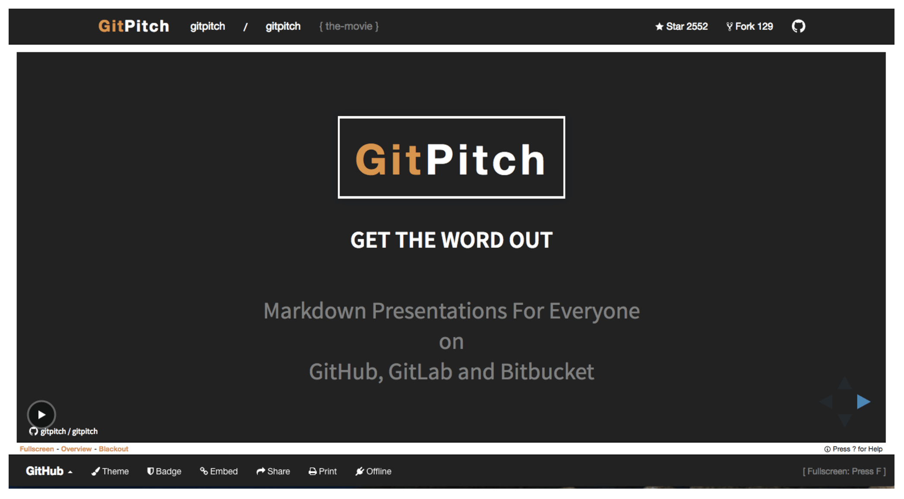

---?image=assets/cover.jpg&size=cover

# gitpitch-azusa

2017.07.29 TokyuRubyKaigi

[@yhirano55](https://github.com/yhirano55)

---?image=bg/pink.png

# [@yhirano55](https://github.com/yhirano55)


- Freelancer from 鎌倉
- Organizer [\#railsdm](https://rails-developers-meetup.connpass.com/)

---

# [GitPitch](https://gitpitch.com/)

## 使用したことありますか!?

---



---

# 使い方

1. リポジトリのルートに `PITCHME.md` を作成
2. ホストを `github.com` から `gitpitch.com` に変更
3. Revael.jsのスライドが表示される

---

# よさ

- 内部は [Reveal.js](http://lab.hakim.se/reveal-js/#/)
- `PITCHME.md` を置くだけ
- セットアップらくちん
- ブランチでプレゼン切替可能
- [Wiki](https://github.com/gitpitch/gitpitch/wiki)が充実している

---

# わるさ

- カスタマイズ必須
- 日本語フォント考慮なし
- PDFのフォントやばい
- [Wiki](https://github.com/gitpitch/gitpitch/wiki)を読むの大変

---
$$\sum_{i=0}^n i^2 = \frac{(n^2+n)(2n+1)}{6}$$
---

コードブロックのハイライトができます。
```python
for i in range(0, 101):
  print("Hello, World!")
end
```

@[1](ハイライト行の解説も記述できます。)
@[2-4](コメントは[]の右に記述します。)
---

おすまい


